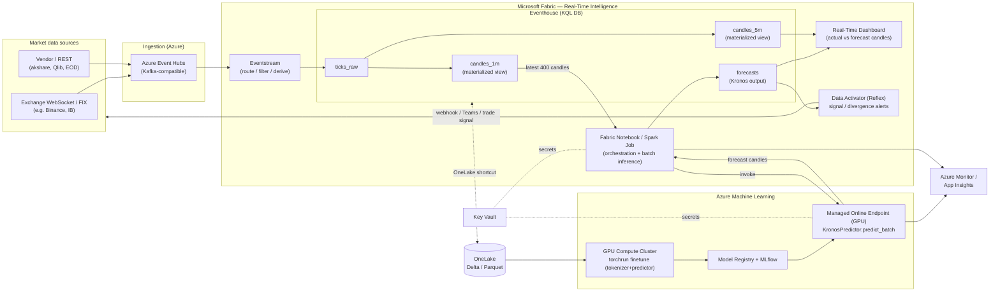

# Running Kronos on Microsoft Azure with Microsoft Fabric Real-Time Intelligence

> A reference solution and architecture for operating the **Kronos** financial
> foundation model (OHLCV / K-line forecasting) as a production, streaming
> forecasting service on Azure, using **Microsoft Fabric Real-Time Intelligence
> (RTI / RTA)** as the data backbone and **Azure Machine Learning** as the GPU
> model plane.

---

## 1. What we are deploying

Kronos is a decoder-only foundation model for the "language" of financial
markets. Its runtime contract (see `model/kronos.py`) is:

```
KronosPredictor.predict(
    df,             # DataFrame of lookback candles: open, high, low, close[, volume, amount]
    x_timestamp,    # timestamps for the lookback window
    y_timestamp,    # timestamps for the horizon to forecast
    pred_len,       # number of future candles
    T, top_p, top_k, sample_count   # probabilistic sampling controls
) -> DataFrame      # forecast candles (OHLCV) indexed by y_timestamp
```

Key properties that shape the architecture:

| Property | Implication for Azure design |
|---|---|
| PyTorch, autoregressive Transformer, HuggingFace weights (`NeoQuasar/*`) | Needs a **GPU inference plane** (Azure ML managed online endpoint) for low-latency serving; CPU works for small models / batch. |
| Context length 512 (base/small) or 2048 (mini); typical `lookback=400`, `pred_len=120` | Each request needs a **rolling window of the most recent candles** — a natural fit for a real-time store (Fabric Eventhouse / KQL). |
| Probabilistic sampling (`sample_count` paths averaged) | Inference latency scales with `sample_count`; make it a request/deployment parameter. |
| `predict_batch` for many symbols at once | Batch many symbols per GPU call to amortize cost — one endpoint call per tick-bucket. |
| Fine-tuning via `torchrun` multi-GPU (tokenizer + predictor) + Qlib | Needs an **Azure ML GPU cluster** and a feature/label store in **OneLake**. |

The goal: **ingest live market data → maintain rolling OHLCV candles →
continuously forecast the next N candles with Kronos → store, visualize, and
alert on forecasts vs. actuals — all in near-real-time.**

---

## 2. Why Fabric Real-Time Intelligence (and where Azure ML fits)

Fabric RTI is purpose-built for exactly the "high-volume, time-series,
act-on-it-now" shape of market data:

- **Eventstream** – no/low-code ingestion from Event Hubs, Kafka, IoT Hub,
  Azure/Amazon/GCP sources, with routing, filtering, and light transforms.
- **Eventhouse / KQL Database (Kusto)** – columnar, time-series-native store
  with sub-second analytical queries, **materialized views** (perfect for
  building OHLCV candles from ticks), update policies, and hot/cold caching.
- **Real-Time Dashboards** – native KQL candlestick / time-series rendering.
- **Data Activator (Reflex)** – condition monitoring → alerts/automation
  (Teams, email, Power Automate, or a webhook that fires a trade signal).
- **OneLake** – the single data lake (Delta/Parquet) that every Fabric engine,
  and Azure ML, reads and writes without copies (shortcuts).

What Fabric RTI is *not* good at: hosting a stateful PyTorch GPU model with
autoregressive decoding at low latency. That is **Azure ML's** job. The two
planes meet at OneLake (for data + model artifacts) and at a thin invocation
boundary (Fabric activity/notebook → Azure ML online endpoint).

> **Design principle:** Fabric owns *data, time, and action*; Azure ML owns
> *the model (train + serve)*. Keep the boundary thin and idempotent.

---

## 3. Reference architecture



### 3.1 End-to-end data flow

1. **Ingest.** Market feeds publish ticks/klines to **Azure Event Hubs**
   (Kafka-compatible, so existing Kafka producers work unchanged). Event Hubs
   gives buffering, partitioning by symbol, and replay.
2. **Stream + shape.** A **Fabric Eventstream** consumes Event Hubs, does light
   normalization (symbol mapping, unit fixes, dedup), and lands raw events in
   the Eventhouse table `ticks_raw`.
3. **Build candles.** **Materialized views** aggregate ticks into OHLCV candles
   at 1-minute and 5-minute grains (`candles_1m`, `candles_5m`). This is exactly
   the OHLCV shape Kronos expects — no extra ETL.
4. **Forecast.** On each closed candle (or on a timer), the **Fabric
   notebook/orchestrator** pulls the latest `lookback` candles per symbol from
   the Eventhouse, builds the batch, and calls the **Azure ML online endpoint**
   running `KronosPredictor.predict_batch`. Forecasts are written back into the
   `forecasts` table.
5. **Visualize.** A **Real-Time Dashboard** overlays actual candles
   (`candles_5m`) with Kronos forecasts (`forecasts`) — the production version of
   the repo's Flask demo, but streaming and multi-symbol.
6. **Act.** **Data Activator** watches for conditions (e.g. forecast predicts
   > X% move, or realized price diverges from forecast beyond a band) and fires
   alerts or a webhook that can seed a downstream trading/risk workflow.
7. **Learn.** Historical candles in OneLake feed **Azure ML fine-tuning**
   (`torchrun` tokenizer + predictor jobs from `finetune/`), producing versioned
   models in the registry that roll out to the endpoint.

---

## 4. Component design

### 4.1 Ingestion — Azure Event Hubs → Fabric Eventstream

- **Event Hubs** namespace, one hub per asset class, partitioned by `symbol`
  (partition key) so per-symbol ordering is preserved. Enable **Capture** to
  OneLake/ADLS for a cheap raw archive.
- **Eventstream** source = Event Hubs; destination = Eventhouse table
  `ticks_raw`. Add an Eventstream **derived stream** to drop malformed events
  and to emit a `symbol`, `price`, `size`, `event_time` canonical schema.
- Alternative low-latency sources: Kronos can also be driven from **historical
  backfill** — batch-load Qlib/akshare CSVs to OneLake and shortcut them into
  the Eventhouse for parity between backtest and live.

### 4.2 Storage & feature engineering — Eventhouse (KQL)

The Eventhouse is the heart of the RTA design. Three responsibilities:

1. **Raw landing** (`ticks_raw`) with a short hot cache + long cold retention.
2. **Candle construction** via **materialized views** — incremental, always
   up-to-date, cheap to read:

   ```kusto
   .create materialized-view candles_1m on table ticks_raw {
       ticks_raw
       | summarize open  = arg_min(event_time, price),
                   high  = max(price),
                   low   = min(price),
                   close = arg_max(event_time, price),
                   volume = sum(size)
         by symbol, bin(event_time, 1m)
   }
   ```

3. **Forecast store** (`forecasts`) — one row per (symbol, forecast_run,
   target_time) with predicted OHLCV, the model version, and sampling params,
   so every forecast is reproducible and comparable to realized candles.

The full scripts are in [`deploy/azure/fabric/eventhouse/`](../../deploy/azure/fabric/eventhouse/).

**Why materialized views over the tick data instead of Spark ETL:** they're
incrementally maintained by the engine, queryable in real time, and remove an
entire moving part. The lookback query the model needs is a single KQL:

```kusto
candles_1m
| where symbol == "BTCUSDT"
| top 400 by event_time desc
| sort by event_time asc
```

### 4.3 Model serving — Azure ML Managed Online Endpoint (GPU)

Kronos is served behind a **managed online endpoint** so it scales, versions,
and is observable independent of the data plane.

- **Compute:** GPU SKU sized to model + throughput. `Kronos-small`/`base` run
  comfortably on a single **NC-family** GPU (e.g. `Standard_NC4as_T4_v3` /
  `NC A10 v4`); `Kronos-large` or high `sample_count` wants A100 (`NC A100 v4`).
  CPU deployment is viable for `mini`/`small` at low QPS and cost.
- **Scoring:** the scoring script (`score.py`) loads the tokenizer + model once
  in `init()` and calls `predict_batch()` per request, so many symbols are
  forecast in one GPU pass. See
  [`deploy/azure/azureml/score.py`](../../deploy/azure/azureml/score.py).
- **Model source:** weights are pulled from the **Azure ML model registry**
  (mirrored from HuggingFace `NeoQuasar/*` or your fine-tuned checkpoints),
  never from the public internet at request time — deterministic, air-gappable.
- **Scaling:** autoscale on GPU utilization / request concurrency; use
  **blue-green (mirror) deployments** to canary a new fine-tune before shifting
  100% of traffic.
- **Contract:** request = list of symbols each with their lookback candles +
  horizon timestamps + sampling params; response = forecast candles per symbol.

> **Latency note:** autoregressive decoding cost ≈ `pred_len × sample_count`.
> For a 120-step horizon with `sample_count=1` on a T4, expect tens to low
> hundreds of ms per symbol; batch symbols and keep `sample_count` small for the
> live path, raise it for periodic high-confidence runs.

### 4.4 Orchestration — Fabric Notebook / Spark Job

A scheduled/triggered **Fabric notebook** (or Spark Job Definition) is the glue:

1. Query the Eventhouse for the latest `lookback` candles for the active symbol
   universe (one KQL, all symbols).
2. Assemble the `predict_batch` payload and POST to the Azure ML endpoint
   (managed-identity auth; endpoint key/token from **Key Vault**).
3. Write the returned forecasts back to the Eventhouse `forecasts` table
   (KQL ingest) and, for lineage, to OneLake Delta.

Trigger options, in order of freshness:
- **Event-driven** (lowest latency): Data Activator / Eventstream detects a
  closed candle and triggers the pipeline.
- **Fabric Data Factory pipeline on a schedule** (e.g. every 1 min) — simplest,
  robust default.
- **Continuous streaming notebook** for the highest-frequency use cases.

Reference: [`deploy/azure/fabric/notebooks/kronos_rt_inference.py`](../../deploy/azure/fabric/notebooks/kronos_rt_inference.py).

> **Serving vs. in-notebook inference:** You *can* load Kronos directly inside a
> Fabric Spark notebook (GPU pools) and skip Azure ML — good for batch/backfill.
> For the live path we recommend the **dedicated endpoint** so model lifecycle,
> autoscale, latency, and cost are decoupled from Fabric capacity.

### 4.5 Visualization — Real-Time Dashboard

A KQL-backed Real-Time Dashboard replaces the repo's Flask demo:
- Candlestick tile: `candles_5m` (actual) overlaid with `forecasts` (predicted),
  per selected symbol.
- Forecast-error tiles: rolling MAE / directional accuracy of closed forecasts
  vs. realized candles.
- Auto-refresh (seconds), parameterized by symbol and horizon.

Query snippets are in
[`deploy/azure/fabric/eventhouse/03_forecast_dashboard_activator.kql`](../../deploy/azure/fabric/eventhouse/03_forecast_dashboard_activator.kql).

### 4.6 Action — Data Activator (Reflex)

Data Activator monitors the `forecasts` (and joined actuals) stream:
- **Signal alert:** predicted close move over the horizon exceeds a threshold →
  notify (Teams/email) or POST a webhook to a downstream strategy/risk service.
- **Model-health alert:** realized-vs-forecast error breaches a control band →
  page the on-call and/or trigger a re-fine-tune pipeline.

This is where "real-time analytics" becomes "real-time action" without custom
polling infrastructure.

### 4.7 Training & fine-tuning — Azure ML GPU

The repo's `finetune/` pipeline (Qlib data prep → `train_tokenizer.py` →
`train_predictor.py` → `qlib_test.py` backtest) maps cleanly to Azure ML:

| Repo step | Azure implementation |
|---|---|
| `qlib_data_preprocess.py` | Fabric/Spark or an Azure ML data-prep job writing train/val/test Delta to **OneLake**. |
| `train_tokenizer.py` (`torchrun`) | Azure ML **command job**, `distribution: pytorch`, multi-GPU cluster. |
| `train_predictor.py` (`torchrun`) | Same, second stage; checkpoints + metrics tracked in **MLflow**. |
| `qlib_test.py` backtest | Azure ML job producing backtest metrics/plots as run artifacts; gate promotion on them. |
| Comet.ml (optional) | Replace with **MLflow** (native to Azure ML & Fabric). |

Registered models are promoted to the online endpoint via CI/CD (see §6).

---

## 5. Cross-cutting concerns

**Identity & secrets.** Entra ID everywhere; **managed identities** for Fabric →
Azure ML, Azure ML → OneLake/registry, and endpoint → Key Vault. No static keys
in code; endpoint tokens and feed credentials live in **Key Vault**.

**Networking.** Private path option: Event Hubs, Azure ML endpoint, Key Vault,
and storage behind **Private Endpoints**; Fabric connects via a **Managed
Private Endpoint**. Public ingress only at the market-data edge (or via a
self-hosted gateway).

**Observability.** Azure ML endpoint → **App Insights** (latency, GPU util,
failures). Eventhouse has built-in ingestion/latency metrics. **Azure Monitor**
workbooks unify pipeline health; alert on end-to-end freshness (candle close →
forecast landed) SLO.

**Reproducibility & lineage.** Every forecast row carries `model_version`,
`sampling_params`, and `run_id`. Fine-tunes are MLflow runs; data is versioned in
OneLake Delta — a forecast can always be traced to model + inputs.

**Cost controls.** Batch symbols per GPU call; scale the endpoint to zero /
min-replicas off-hours; keep `sample_count` low on the live path; use T4/A10 for
small/base and reserve A100 for `large`/high-confidence batch runs; Eventhouse
hot-cache only recent data.

**Resilience/DR.** Event Hubs replay + Capture archive means the stream can be
rebuilt; Eventhouse materialized views recompute from `ticks_raw`; models and
data are in OneLake/registry. Multi-region is achieved by pairing Event Hubs geo-
DR with a secondary Fabric capacity and endpoint.

**Governance / compliance.** Market data lineage via OneLake + Purview;
forecasts are advisory signals — keep a human/risk gate before any automated
trading action (the Data Activator webhook should hit a *strategy* service that
enforces limits, not place orders blindly).

---

## 6. Deployment & MLOps

- **Infrastructure as Code:** Bicep skeleton for Event Hubs, Key Vault, Azure ML
  workspace, and endpoint in [`deploy/azure/infra/main.bicep`](../../deploy/azure/infra/main.bicep).
  Fabric items (Eventhouse, Eventstream, dashboards) are provisioned via Fabric
  REST/Git integration and the KQL scripts in this repo.
- **Model CI/CD:** GitHub Actions (or Azure DevOps) →
  `az ml model create` → `az ml online-deployment create` (blue/green) →
  smoke test → shift traffic. Gate on backtest metrics from `qlib_test.py`.
- **Fabric CI/CD:** Fabric Git integration deploys Eventhouse KQL, Eventstream,
  notebooks, and dashboards across dev/test/prod workspaces.

---

## 7. Environment / capacity sizing (starting point)

| Concern | Dev / PoC | Production |
|---|---|---|
| Fabric capacity | F2–F4 | F16+ (scale with symbol count & dashboard users) |
| Event Hubs | Standard, 1–2 TU | Premium/Dedicated, partitioned by symbol |
| AML endpoint | 1× T4 (or CPU for `mini`) | 2–N× T4/A10 autoscaled; A100 for `large` |
| AML training | 1× T4 on-demand | 2–8× A100 cluster, low-priority for cost |
| Eventhouse | default cache | hot cache = live window; cold = history in OneLake |

---

## 8. How this maps back to the repo

| Kronos repo asset | Azure/Fabric home |
|---|---|
| `model/` (`Kronos`, `KronosTokenizer`, `KronosPredictor`) | Loaded in the AML endpoint `score.py`; weights in AML registry. |
| `examples/prediction*.py` (`predict`) | The synchronous request path of the endpoint. |
| `predict_batch` | The multi-symbol batch call from the Fabric orchestrator. |
| `webui/` Flask demo | Replaced by the Fabric **Real-Time Dashboard** (streaming, multi-symbol). |
| `finetune/` (`torchrun` tokenizer + predictor, Qlib) | Azure ML GPU **command jobs**; data in OneLake; MLflow tracking. |
| `finetune/qlib_test.py` backtest | Azure ML evaluation job; promotion gate. |

---

## 9. Reference artifacts in this PR

```
docs/azure/
  kronos-on-azure-fabric-rta.md      # this document
  README.md                          # index + quickstart
deploy/azure/
  fabric/eventhouse/
    01_raw_and_bronze.kql            # ticks_raw table, ingestion mapping, retention
    02_ohlcv_materialized_views.kql  # candles_1m / candles_5m materialized views
    03_forecast_dashboard_activator.kql  # forecasts table, dashboard & Activator queries
    04_signals_and_alerts.kql        # signals + model_health_alerts tables & scoreboards
  fabric/notebooks/
    kronos_rt_inference.py           # orchestrator: Eventhouse -> AML endpoint -> Eventhouse
  azureml/
    score.py                         # endpoint scoring: KronosPredictor.predict_batch
    endpoint.yml                     # managed online endpoint
    deployment.yml                   # GPU deployment
    environment/conda.yml            # serving environment
  infra/
    main.bicep                       # Event Hubs + Key Vault + AML workspace/endpoint skeleton
  demo/                              # runnable, zero-dependency end-to-end demo
    synthetic.py                     # tick feed + OHLCV candle aggregation
    forecaster.py                    # KronosAdapter (real Kronos or baseline)
    pipeline.py                      # rolling forecasts, signals, drift guardrail
    kql_emit.py                      # emit every stage as replayable Eventhouse KQL
    report.py                        # self-contained HTML report
    run_demo.py                      # narrated runner
```

These are **reference scaffolding** to make the design concrete and runnable in
stages — not a turnkey deployment. Fill in workspace names, capacities, symbol
universe, and secrets for your environment.

The **demo round-trips through KQL**: `run_demo.py` writes `output/kql/*.kql`
(`.set-or-append` batches against the schemas above), so you can replay the whole
synthetic session — `ticks_raw` → `candles_1m` materialized view → `forecasts`,
`signals`, `model_health_alerts` — into a real Fabric Eventhouse and drive the
Real-Time Dashboard and Data Activator from it. See
[`deploy/azure/demo/`](../../deploy/azure/demo/).

---

## 10. References

Official documentation for every component named above — Kronos (GitHub / Hugging
Face / arXiv) and each Azure & Fabric service (Microsoft Learn) — is collected,
with a concept-by-concept mapping, in **[`references.md`](./references.md)**.

Quick links: [Kronos](https://github.com/shiyu-coder/Kronos) ·
[paper](https://arxiv.org/abs/2508.02739) ·
[Fabric Real-Time Intelligence](https://learn.microsoft.com/fabric/real-time-intelligence/overview) ·
[Eventhouse](https://learn.microsoft.com/fabric/real-time-intelligence/eventhouse) ·
[Materialized views](https://learn.microsoft.com/fabric/real-time-intelligence/materialized-view) ·
[Data Activator](https://learn.microsoft.com/fabric/real-time-intelligence/data-activator/) ·
[Azure ML online endpoints](https://learn.microsoft.com/azure/machine-learning/concept-endpoints-online?view=azureml-api-2) ·
[Event Hubs](https://learn.microsoft.com/azure/event-hubs/) ·
[OneLake](https://learn.microsoft.com/fabric/onelake/onelake-overview).
