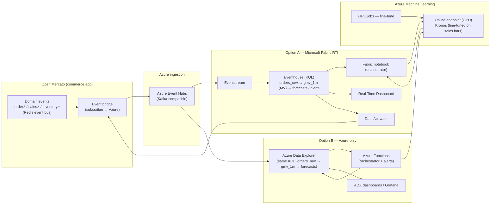

# Real-time demand intelligence: Open Mercato × Kronos × Azure

> A reference solution for turning a live **[Open Mercato](https://github.com/open-mercato/open-mercato)**
> commerce stream (orders, sales, inventory events) into **real-time demand
> forecasts you can act on**, using the **Kronos** time-series foundation model on
> **Azure** — shown two ways: with **Microsoft Fabric Real-Time Intelligence**, and
> **Azure-only** (no Fabric).

This is the commerce sibling of the markets solution in
[`../azure/`](../azure/). The architecture is deliberately the same shape — only
the **data source** changes (a market feed → an Open Mercato event stream) and the
**thing being forecast** changes (price candles → sales bars).

---

## 0. The honest fit (read this first)

**Kronos is pre-trained on financial K-lines (OHLCV price data), not e-commerce
demand.** So be precise about what's claimed:

- ✅ **Reframe, don't force.** Open Mercato order events aggregate cleanly into
  **OHLC-style "sales bars"** per interval — open/high/low/close of order value,
  plus units and GMV. That's the *exact tensor shape* `KronosPredictor.predict`
  expects, so the model runs unchanged.
- ⚠️ **Zero-shot is a starting point, not the answer.** Out-of-the-box Kronos on
  commerce bars is a baseline. For useful accuracy, **fine-tune Kronos on the
  merchant's own sales bars** (the repo's `finetune/` pipeline) — commerce
  seasonality (hour-of-day, day-of-week, promotions) is learnable and very
  different from crypto.
- ✅ **The durable value isn't the point forecast — it's the loop + guardrail.**
  Real-time demand forecasts *and* an automatic alarm when the forecast stops
  tracking reality (a flash-sale spike, a stockout, a checkout outage, a fraud
  wave). That's valuable even when the raw forecast is only decent.
- ❌ **Not** a promise of perfect demand prediction, and **not** a Microsoft or
  Open Mercato product — a reference pattern using both open-source projects on
  supported Azure services.

If a stakeholder wants "predict my sales exactly," redirect to "forecast demand
in real time **and know the moment the model is wrong**" — the same reframing that
makes the markets solution honest.

---

## 1. What we forecast (Open Mercato → sales bars)

Open Mercato is an **event-driven** commerce/ERP framework: its modules (OMS,
Sales, CRM, ERP) **publish domain events** processed via persistent (Redis)
subscribers, and expose auto-generated APIs. Those events are our feed.

| Open Mercato signal | Becomes a time series | Kronos forecasts |
|---|---|---|
| `order.created` / `order.paid` (amount, qty, items) | **GMV per minute**, orders/min, units/min → OHLC bars | next N minutes of demand |
| `sales.quote.*`, cart/checkout events | conversion / funnel rate over time | short-horizon conversion |
| `inventory.updated`, stock movements | depletion rate per SKU | time-to-stockout |

**The bar.** Aggregate order events into an interval bar with the OHLCV schema
Kronos consumes:

| Column | Meaning for commerce |
|---|---|
| `open` / `close` | first / last order value in the interval |
| `high` / `low` | max / min order value |
| `volume` | units sold in the interval |
| `amount` | GMV (revenue) in the interval |

Now Kronos "reads recent sales bars and writes the next ones" — identical
mechanics to price candles.

---

## 2. Reference architecture (source swap, same loop)



**Fabric owns data/time/action; Azure ML owns the model** — same principle. The
only new component is the **event bridge**.

---

## 3. The bridge (the one genuinely new piece)

Open Mercato publishes domain events to a **Redis-backed subscriber** system. The
bridge is a small **subscriber that forwards events to Azure Event Hubs** — it's
the seam between the commerce app and the real-time plane.

- **Native (recommended):** a Node/TypeScript Open Mercato **event subscriber**
  (the framework's own extension point) that publishes to Event Hubs via the
  Kafka or AMQP client. Runs in-process with the app; no polling.
- **Decoupled:** an outbox/webhook → a tiny **Azure Function / container** that
  receives Open Mercato webhooks and produces to Event Hubs. Better isolation,
  language-agnostic.

Reference implementations (Node + Python) are in
[`../../deploy/openmercato/bridge/`](../../deploy/openmercato/bridge/). Payload
contract (canonical, tenant-scoped):

```json
{ "tenant_id": "t_123", "event": "order.paid", "event_time": "2025-03-03T14:00:05Z",
  "order_id": "o_987", "amount": 128.40, "currency": "USD", "units": 3, "channel": "web" }
```

Multi-tenancy carries through as a partition key (`tenant_id`) so each merchant's
bars and forecasts stay isolated end-to-end.

---

## 4. Option A — Microsoft Fabric Real-Time Intelligence

Identical to the markets solution, retargeted to commerce tables:

- **Eventstream** ← Event Hubs → `orders_raw` in the **Eventhouse**.
- **Materialized view** `gmv_1m` builds sales bars from `orders_raw` (same
  `arg_min/arg_max/max/min/sum` pattern that builds candles).
- **Orchestrator** (Fabric notebook) pulls the lookback of bars per tenant/SKU,
  calls the **Azure ML endpoint** (Kronos), writes `forecasts`.
- **Real-Time Dashboard** overlays actual vs forecast GMV; **Data Activator**
  fires on demand signals and on the model-health guardrail — routing to Teams, a
  webhook, or **back into Open Mercato** (e.g., trigger a restock workflow via its
  API).

Reuses the KQL patterns in [`../azure/`](../azure/) with commerce table names.

## 5. Option B — Azure-only (no Fabric)

For customers not on Fabric, the same loop on core Azure:

| Fabric piece | Azure-only equivalent |
|---|---|
| Eventstream | Event Hubs → **Azure Data Explorer** data connection (or Stream Analytics) |
| Eventhouse (KQL) | **Azure Data Explorer** (same KQL, same materialized views) |
| Fabric notebook orchestrator | **Azure Functions** (timer/event trigger) calling the AML endpoint |
| Real-Time Dashboard | **ADX dashboards** or **Grafana** on ADX |
| Data Activator | **Azure Functions + Azure Monitor alerts**, or Logic Apps |

Because **both Fabric Eventhouse and Azure Data Explorer speak KQL**, the table
definitions, materialized views, and forecast/alert queries are **the same
scripts** — you point them at whichever cluster you run. That's the portability
win: write the KQL once, land it in Fabric *or* ADX.

---

## 6. Forecasting & the guardrail (unchanged from markets)

- **Rolling forecast:** on each closed bar, forecast the next N (e.g., 30-minute
  GMV horizon) per tenant/segment via `predict_batch`.
- **Demand signals:** Data Activator fires when the forecast expects a large move
  (a surge → pre-scale/pre-stock; a drop → investigate).
- **Model-health guardrail:** rolling forecast-vs-actual error breaches a learned
  band → auto-alert. In commerce this catches **flash-sale spikes, stockouts,
  checkout/payment outages, and fraud waves** — the forecast breaks from reality,
  and you find out in minutes.

The demo in [`../../deploy/openmercato/`](../../deploy/openmercato/) runs this
end-to-end on a synthetic Open Mercato order stream (a flash-sale surge + a
checkout-outage shock), reusing the same pipeline and guardrail as the markets
demo.

---

## 7. Fine-tuning Kronos for commerce (the accuracy path)

Zero-shot gets you a working loop; fine-tuning gets you accuracy.

1. Export the merchant's historical `gmv_1m` bars from the Eventhouse/ADX to
   **OneLake / storage** (Delta/Parquet).
2. Run the repo's **`finetune/`** tokenizer + predictor jobs on **Azure ML GPU**
   over those bars (commerce seasonality: hour, day-of-week, promo flags as time
   features).
3. Register the fine-tuned model in **MLflow / Azure ML registry**; blue-green it
   onto the online endpoint.

The endpoint contract (`score.py`) is unchanged — sales bars in, forecast bars
out — so nothing downstream changes when you swap in the fine-tuned model.

---

## 8. Cross-cutting

Same as the markets solution: Entra ID + managed identities, Key Vault for the
bridge's Event Hubs credentials, private endpoints optional, Azure Monitor / App
Insights for the endpoint, and per-tenant isolation carried as the partition key.
Governance note specific to commerce: order events contain **PII** — Open Mercato
already does field-level encryption; keep PII out of the bars (aggregate to
counts/amounts) and out of Event Hubs where possible.

---

## 9. What to build (mirrors the markets package)

- **Architecture** — this document (Fabric + Azure-only).
- **Runnable demo** — [`../../deploy/openmercato/`](../../deploy/openmercato/):
  synthetic Open Mercato order stream → sales bars → Kronos forecast → guardrail,
  with KQL round-trip (works against Fabric Eventhouse **or** ADX).
- **Bridge** — Open Mercato event subscriber → Event Hubs (Node + Python).
- **Deck** — a visual walkthrough of the commerce loop.

## 10. References

Open Mercato: <https://github.com/open-mercato/open-mercato>. Everything Azure/
Fabric/Kronos is in [`../azure/references.md`](../azure/references.md). Additional:
[Azure Data Explorer — ingest from Event Hubs](https://learn.microsoft.com/azure/data-explorer/ingest-data-event-hub-overview) ·
[Event Hubs for Apache Kafka](https://learn.microsoft.com/azure/event-hubs/azure-event-hubs-apache-kafka-overview) ·
[Azure Functions](https://learn.microsoft.com/azure/azure-functions/functions-overview).
